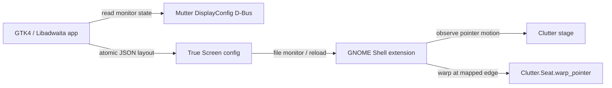

# True Screen — Phase 1 Plan

สถานะ: Prototype รอบแรกพร้อมทดลองบน session จริง  
เป้าหมายระบบ: Fedora Linux 44, GNOME 50, Wayland  
อัปเดตล่าสุด: 2026-08-10

## 1. เป้าหมายของ Phase 1

สร้าง prototype ที่พิสูจน์ end-to-end flow ต่อไปนี้ได้จริง:

1. เปิดแอปแล้วเห็นจอที่ต่ออยู่เป็นการ์ดบน canvas
2. ลากจอเพื่อจัดตำแหน่งตามโต๊ะจริงได้
3. ปรับขนาดการ์ดจอเพื่อแทนขนาดทางกายภาพได้ โดยค่าเริ่มต้นล็อก aspect ratio
4. กด `Start` แล้ว cursor ข้ามระหว่างจอตามตำแหน่งและสัดส่วนที่กำหนดใน canvas
5. แก้ layout แล้วกด `Apply` เพื่อเห็นผลกับ cursor ได้โดยไม่ logout หรือ restart GNOME
6. กด `Stop` หรือ emergency shortcut แล้วกลับสู่พฤติกรรม cursor ปกติทันที

คำว่า “ปรับขนาดจอ” ใน Phase 1 หมายถึงปรับ **physical mapping** ของจอใน True
Screen ไม่ใช่เปลี่ยน resolution, refresh rate หรือ GNOME display scale จริง

## 2. สิ่งที่ไม่ทำใน Phase 1

- ไม่เปลี่ยน resolution, refresh rate, rotation หรือ GNOME fractional scaling
- ไม่แทนที่หน้า Displays ของ GNOME Settings
- ไม่รองรับ X11, KDE หรือ compositor อื่น
- ไม่ทำ Flatpak หรือเผยแพร่ RPM
- ไม่ทำหลาย profile, auto-switch ตาม dock หรือ hot-plug แบบสมบูรณ์
- ไม่แก้ Mutter และไม่ติดตั้ง patched compositor
- ไม่รับประกันการทำงานกับเกมที่จับ pointer แบบ locked/relative, remote desktop,
  tablet/stylus หรือหลาย seat
- ไม่เน้นงาน visual polish, localization หรือ accessibility ขั้นสมบูรณ์

## 3. ข้อสรุปทางเทคนิค

Phase 1 ใช้สอง process:



### 3.1 Technology choice

- **GJS (JavaScript ES modules)** สำหรับ GTK4/Libadwaita app และ GNOME Shell
  extension เพื่อให้ Phase 1 ไปถึง working prototype เร็ว และใช้ GNOME APIs โดยตรง
- **Meson** สำหรับ build/install ในโหมด developer
- **GLib/Gio** สำหรับ D-Bus, file monitoring และ config I/O
- **Node.js test runner** หรือ GJS test harness สำหรับ pure mapping engine
- ใช้ host install ระหว่างพัฒนา ไม่ sandbox ด้วย Flatpak

หลังพิสูจน์ prototype แล้วค่อยประเมินการย้าย app/core ไป Rust ใน Phase 2 โดยไม่
เปลี่ยน file format และ mapping contract

### 3.2 Monitor discovery

แอปอ่าน `org.gnome.Mutter.DisplayConfig.GetCurrentState` เพื่อรับ:

- connector และ monitor identity
- active mode และ logical monitor rectangle
- GNOME scale และ transform
- primary monitor และสถานะ built-in

ขนาดทางกายภาพใช้ลำดับแหล่งข้อมูลดังนี้:

1. EDID หรือข้อมูลที่ระบบอ่านได้
2. ค่าที่ user กำหนดเองเป็นมิลลิเมตร
3. fallback จากขนาดแนวทแยงและ aspect ratio

ต้องไม่เชื่อ EDID แบบไม่มีทางแก้ เพราะบางจอรายงานชื่อหรือขนาดคลาดเคลื่อน

### 3.3 Pointer routing

GNOME Shell extension เป็นส่วนที่ทำงานใน compositor process และมีหน้าที่:

- ฟัง pointer motion จาก Clutter stage
- รู้ logical rectangle ปัจจุบันของแต่ละจอ
- โหลด physical rectangles ที่ user จัดไว้
- ตรวจว่า pointer กำลังเคลื่อนออกจากขอบซึ่งเชื่อมกับจอใดใน physical layout
- แปลงตำแหน่งบนขอบจาก physical millimetres ไปเป็น logical coordinates ของจอปลายทาง
- เรียก `Clutter.Seat.warp_pointer(x, y)` ให้ cursor เข้าไปด้านในของจอปลายทางเล็กน้อย
- ใช้ direction check, epsilon และ cooldown ป้องกัน cursor เด้งกลับไปมา

ตัวอย่างการ map บนขอบแนวตั้ง:

```text
physical_y = source_mm.y
           + ((cursor_y - source_logical.y) / source_logical.height)
           * source_mm.height

target_cursor_y = target_logical.y
                + ((physical_y - target_mm.y) / target_mm.height)
                * target_logical.height
```

หากตำแหน่ง `physical_y` ไม่อยู่ในช่วงขอบของจอปลายทาง cursor จะไม่ข้ามจอ ณ
จุดนั้น การข้ามขอบแนวนอนใช้หลักเดียวกันกับแกน X

Phase 1 รองรับเฉพาะขอบที่แตะกันภายใน snap tolerance; physical gap จะยังไม่ทำ
ray projection หรือกระโดดข้ามช่องว่าง

### 3.4 Config contract

เก็บ config ที่ `$XDG_CONFIG_HOME/true-screen/layout.json` ด้วย schema version และ
เขียนแบบ atomic replace เพื่อไม่ให้ extension อ่านไฟล์ครึ่งหนึ่ง ตัวอย่างโครงสร้าง:

```json
{
  "schemaVersion": 1,
  "enabled": true,
  "monitors": [
    {
      "id": "connector+vendor+product+serial",
      "connector": "DP-1",
      "physical": { "xMm": 0, "yMm": 0, "widthMm": 600, "heightMm": 340 }
    }
  ]
}
```

serial จริงจะไม่แสดงใน UI และ log ปกติ เมื่อ serial ไม่มีหรือไม่น่าเชื่อถือให้ใช้
connector + vendor + product พร้อมระบุว่า identity อาจเปลี่ยนหลังสลับพอร์ต

## 4. UX คร่าว ๆ

หน้าต่างหลักแบ่งเป็นสามส่วน:

- Header bar: `Refresh`, สวิตช์ `Enabled`, `Apply`, เมนู diagnostics
- Canvas: การ์ดจอตามสัดส่วนจริง ลากได้ มี resize handles, snap guides และหมายเลขจอ
- Inspector: connector/model, resolution, scale, width/height (mm), lock aspect ratio,
  `Reset from EDID`

พฤติกรรมสำคัญ:

- ครั้งแรก import ตำแหน่งจาก GNOME แล้ว normalize ให้เห็นครบใน canvas
- เลือกจอแล้วลากหรือ resize ได้ทันที แต่ cursor ยังไม่เปลี่ยนจนกด `Apply`
- แสดง draft ต่างจาก active layout ให้ชัด
- `Stop` ต้องกดได้เสมอ แม้ layout ไม่ valid
- แจ้งเตือนเมื่อจอซ้อนกัน, ไม่มีจอ primary, identity ซ้ำ หรือไม่มีขอบเชื่อมกัน

## 5. Technical spike ที่ต้องผ่านก่อนสร้าง UI เต็ม

Preflight บนเครื่องพัฒนา ณ วันที่เขียนแผนยืนยันแล้วว่า Fedora 44 ใช้ GNOME Shell
50.3 / Mutter 50.3, typelib `Clutter-18` มี GJS binding ชื่อ `warp_pointer` และ
shared library export `clutter_seat_warp_pointer` อยู่จริง อย่างไรก็ตามยังต้องทำ spike
ใน shell session เพื่อยืนยันพฤติกรรม end-to-end ไม่ใช่อาศัยเพียงการมี symbol

ทำ extension ขนาดเล็กบน GNOME 50.3 ของเครื่องพัฒนาเพื่อยืนยันสี่ข้อ:

1. รับ global pointer motion ได้ต่อเนื่องบน Wayland
2. อ่านตำแหน่ง cursor และ logical monitor geometry ได้
3. `Clutter.Seat.warp_pointer()` ย้าย cursor ข้ามจอได้จริง
4. warp ไม่ทำให้ click/drag state เสีย และไม่เกิด feedback loop

ผลลัพธ์ของ spike ต้องมี log ที่ปิดข้อมูลส่วนตัว, enable/disable script และ manual
test note หากข้อ 1–3 ไม่ผ่านภายใน timebox ให้หยุดงาน UI integration แล้วเลือก fallback
ดังนี้:

- ทางเลือก A: เปลี่ยนไปใช้ privileged `evdev/uinput` helper พร้อม explicit setup
- ทางเลือก B: ลด Phase 1 เป็น UI + simulated cursor และเปิด issue สำหรับ Mutter API

สำหรับเป้าหมายที่ตกลงกันไว้ ให้เลือก A ก่อน B เพราะ Phase 1 ต้องขยับ cursor จริง
แต่ต้องยอมรับว่า A เพิ่มงานด้าน permission, device grab และ recovery อย่างมาก

## 6. Milestones

สถานะ ณ 2026-08-10:

- M0 ผ่าน: พิสูจน์ motion event และ cursor warp บน GNOME 50 Wayland แบบสองจอ
- M1 ผ่านระดับ prototype: monitor discovery, physical model และ mapping tests
- M2 ผ่านระดับ prototype: canvas, selection, drag, resize, snap และ numeric inspector
- M2 เพิ่ม pairwise ruler overlay: เลือกจอหลักและจอเทียบเพื่อดูช่วง X/Y, origin
  offset, gap และ overlap เป็นมิลลิเมตรแบบ live ระหว่าง drag/resize
- M3 ผ่าน automated integration: Apply, Enabled และ config auto-reload ทำงานกับ
  GNOME Shell test session; ยังต้องทดสอบพฤติกรรมจริงระยะยาวและ emergency shortcut
- หลังทดสอบกับจอจริง เปลี่ยน unmapped edge เป็น fail-open แทน warp-back เพื่อไม่ให้
  cursor ติดจอเดิมเมื่อ physical overlap มีเพียงบางช่วง
- Ruler overlay ส่งคู่จอผ่าน config และวาดบน desktop จริงด้วย Shell actors ที่ไม่รับ input
- monitor model ใช้ Mutter transform เพื่อหมุน physical dimensions และแสดง rotation mode
- desktop overlay highlight current monitor ใน pair mini-map และ mapped edge ที่ใช้งานจริง
- proactive edge routing ใช้ Clutter relative motion เพื่อข้ามช่วง physical edge ที่ไม่มี
  native logical transition ทำให้เส้นทางกลับยังใช้ได้หลังขยายขนาดจอ
- M4 ยังไม่เริ่ม: packaging, diagnostics, real-monitor matrix และ soak test

### M0 — Repository and proof spike (0.5–1.5 วัน)

- ตั้ง Meson project, app id และ extension UUID
- ทำ shell extension ที่ warp cursor จาก shortcut หรือ fixed edge rule
- บันทึกผล spike และตัดสินใจ extension vs. uinput fallback

**Exit:** cursor ถูกย้ายข้ามจอจริงบน Fedora 44 GNOME Wayland และปิด extension แล้ว
กลับสู่ปกติ

### M1 — Monitor model and mapping engine (1–2 วัน)

- parse `GetCurrentState`
- สร้าง monitor identity และ physical/logical rectangle models
- implement adjacency, snap, overlap validation และ edge mapping
- unit tests สำหรับจอคนละความละเอียด, DPI, scale และ offset

**Exit:** pure mapping tests ผ่าน รวม corner, negative coordinates และ non-overlap

### M2 — Rough GUI (2–3 วัน)

- canvas แสดงจอตาม physical size
- selection, drag, resize, aspect lock และ inspector
- import/reset layout และ validation feedback
- save/load draft config

**Exit:** user จัดจอ 2–3 จอและเปิดใหม่แล้วยังได้ layout เดิม

### M3 — Live cursor integration (1–2 วัน)

- extension โหลด active config และติดตาม config change
- route cursor ทั้งแนวนอนและแนวตั้ง
- `Apply`, `Enabled`, `Stop` และ emergency shortcut
- monitor-change handling และ invalid-config fail-safe

**Exit:** ปรับ layout ใน GUI แล้ว cursor ใช้ mapping ใหม่โดยไม่ restart session

### M4 — Stabilization and demo package (1–2 วัน)

- unit tests, lint และ install/uninstall developer scripts
- manual test matrix กับจอจริงอย่างน้อย 2 ขนาดและ 2 resolution
- diagnostics page/logging ที่ไม่เปิดเผย serial โดย default
- README: build, run, recover, known limitations

**Exit:** demo ซ้ำได้หลัง reboot/login และมี recovery instructions ที่ทดสอบแล้ว

ประมาณการรวม: **6–10 วันทำงาน** หลัง M0 ผ่าน ทั้งนี้ไม่รวม uinput fallback หาก
GNOME Shell APIs ใช้ไม่ได้

## 7. Acceptance criteria ของ Phase 1

- [x] รัน automated integration บน Fedora 44 GNOME 50 Wayland
- [x] ตรวจพบ active monitors และแสดง connector/model/resolution/scale ได้
- [x] GUI แสดงการ์ดจอตาม physical proportion
- [x] ลากและ resize จอ พร้อม numeric width/height ได้
- [x] เปิด ruler overlay เพื่อเทียบขอบเขตและระยะของจอสองใบได้
- [x] บันทึกและโหลด layout เดิมได้
- [x] cursor ข้ามจอตาม vertical/horizontal physical alignment ใน isolated Shell test
- [x] จอที่ physical height ต่างกัน map จุดข้ามอย่างเป็นสัดส่วน ไม่มี jump แบบ 1:1 pixels
- [x] บริเวณขอบที่ไม่มี mapping ปล่อย native transition และไม่ warp cursor กลับ
- [x] `Apply` มีผลโดยไม่ restart GNOME ใน isolated Shell test
- [ ] `Stop` และ emergency shortcut คืน cursor behavior ปกติทันที
- [x] config เสียแล้ว extension fail-safe เป็น disabled/no-op
- [ ] ไม่มี compositor crash และไม่มี cursor feedback loop ใน manual soak test 30 นาที

## 8. Test matrix

### Automated

- rectangle normalization และ negative coordinates
- edge adjacency ภายใน/นอก snap tolerance
- source/target ต่าง aspect ratio และ physical height
- scale 1.0, 1.25, 1.5 และ 2.0
- rotated monitor ถูก reject อย่างชัดเจนใน Phase 1
- duplicate/missing identity และ malformed config
- cooldown และ epsilon ป้องกัน ping-pong

### Manual on real GNOME Wayland session

- 2 จอวางซ้าย–ขวา ขนาดเท่ากัน
- 2 จอความสูงจริงต่างกัน
- 3 จอที่มี offset ทั้ง X และ Y
- ข้ามขณะลากหน้าต่างและลากไฟล์
- เปิด overview, quick settings และ lock/unlock session
- hot-plug หนึ่งจอระหว่างเปิดใช้งาน
- disable/uninstall extension แล้ว cursor กลับสู่ปกติ

เกมที่ใช้ pointer lock และ remote desktop เป็น known limitation แต่ต้องยืนยันอย่างน้อยว่า
extension ไม่ crash; เมื่อพบ pointer lock ให้ routing หยุดทำงานชั่วคราวถ้าตรวจจับได้

## 9. Risks และแนวลดความเสี่ยง

| Risk | ผลกระทบ | วิธีรับมือใน Phase 1 |
|---|---|---|
| GNOME Shell/Clutter APIs เป็น internal และเปลี่ยนตามรุ่น | extension พังเมื่อ GNOME update | target GNOME 50 เท่านั้น, M0 spike, version guard |
| Global motion event หรือ pointer warp ใช้ไม่ได้ตามที่คาด | ทำ core feature ไม่ได้ | timebox M0 และใช้ uinput fallback |
| Warp loop ที่มุม/ขอบ | cursor สั่นหรือติด | direction check, 1–2 px inset, cooldown, last-transition token |
| EDID ขนาดผิด | mapping ผิด | manual width/height และ reset control |
| Hot-plug/connector เปลี่ยน | จอจับคู่ผิด | stable identity หลาย field, disable unmatched entries |
| Pointer lock/game interaction | gameplay เสีย | suspend routing เมื่อ detect grab/lock, document limitation |
| Extension exception กระทบ shell | session ใช้งานลำบาก | fail-closed, minimal event handler, emergency shortcut, tested uninstall |
| uinput fallback ต้องใช้สิทธิ์สูง | security/setup complexity | ใช้เฉพาะเมื่อ extension spike ไม่ผ่าน, least privilege, no root daemon |

## 10. Definition of done

Phase 1 จบเมื่อ acceptance criteria ผ่านบนเครื่อง Fedora 44 จริง มี source code,
automated mapping tests, developer install/uninstall flow และวิดีโอหรือ test note ที่แสดงว่า
การ resize/align ใน GUI เปลี่ยนตำแหน่ง cursor transition จริง

สิ่งที่ควรพิจารณาต่อใน Phase 2 ได้แก่ multiple profiles, auto-switch, rotation,
physical gaps/ray projection, packaging, settings migration และ compatibility กับ GNOME รุ่นถัดไป
